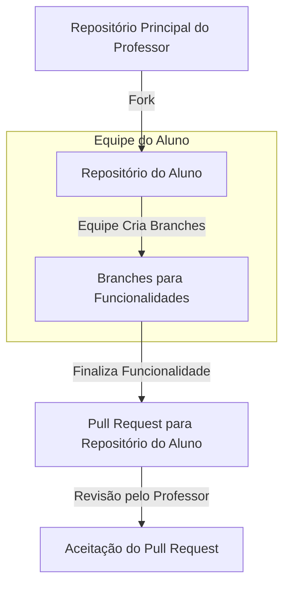

# 👾 Equipe

## 🧙‍♂️ Membros

- [Houston Barros](https://github.com/houstonsbarros)
- [Carlos Seixas](https://github.com/CarlosSeixas2)
- [Breno Ramon](https://github.com/brenoramon123)

## 🤔 Como funcionarão as tasks

- A branch `main` será a branch de produção
- Branch principal será a `develop` para desenvolvimento
- Cada task será uma issue no repositório
- Gerenciamento de tasks através do quadro de issues do GitHub

## 🚀 Fluxo de trabalho

- Cada membro da equipe irá trabalhar em sua própria branch
- Ao finalizar a task, o membro irá criar um pull request para a branch `develop`

## 🗃️ Como serão organizadas as tasks

- As tasks serão organizadas em sprints
- Cada sprint terá uma duração de **\***
- Ao final de cada sprint, será feita uma reunião de retrospectiva para avaliar o andamento do projeto e planejar a próxima sprint
- As tasks serão organizadas em ordem de prioridade, de acordo com o backlog do projeto
- As tasks serão divididas em tarefas menores, de forma que cada membro da equipe possa trabalhar em uma tarefa por vez
- Elas serão organizadas no quadro de issues do GitHub, com as seguintes colunas:
  - **To Do**: tarefas que ainda não foram iniciadas
  - **In Progress**: tarefas que estão em andamento
  - **Review**: tarefas que estão prontas para revisão
  - **Done**: tarefas que foram concluídas

## 📝 Documento de Alterações

- Todas as alterações no projeto serão documentadas no arquivo `CHANGELOG.md`
- O arquivo `CHANGELOG.md` seguirá o formato [Keep a Changelog](https://keepachangelog.com/en/1.0.0/)

- A versão do projeto seguirá o formato [Semantic Versioning](https://semver.org/)

Como exemplo, o arquivo `CHANGELOG.md` terá o seguinte formato:

```markdown
## [1.0.0] - 2024-07-12

### Added

- Nova funcionalidade
- Outra nova funcionalidade

### Changed

- Alteração em uma funcionalidade existente

### Fixed

- Correção de um bug

### Removed

- Remoção de uma funcionalidade
```

## 📬 Documento de solicitações

- Todas as solicitações de funcionalidades serão documentadas no arquivo `REQUESTS.md`

Como exemplo, o arquivo `REQUESTS.md` terá o seguinte formato:

```markdown
# SOLICITAÇÕES DE FUNCIONALIDADES

## 2024-07-12 - [SOLICITANTE] - [TÍTULO DA SOLICITAÇÃO]

## Descrição

[Descrição detalhada da funcionalidade que você gostaria de solicitar.]

## Motivação

[Explique por que essa funcionalidade é importante ou útil para o projeto ou usuário.]

## Detalhes Técnicos (Opcional)

[Caso haja detalhes técnicos específicos que você gostaria de sugerir ou considerar.]

## Exemplos (Opcional)

[Inclua exemplos ou casos de uso que ilustram como essa funcionalidade seria usada.]

## Considerações Adicionais (Opcional)

[Qualquer outra informação relevante que você gostaria de incluir.]

## Impacto Potencial

[Discuta o impacto que essa funcionalidade pode ter no projeto ou nos usuários.]

## Alternativas Consideradas (Opcional)

[Se houver, liste alternativas que foram consideradas para atingir o mesmo objetivo.]

## Implementação Sugerida (Opcional)

[Caso tenha sugestões sobre como essa funcionalidade poderia ser implementada.]

## Anexos (Opcional)

[Qualquer documento ou artefato adicional que apoie esta solicitação.]

---

[Inserir data e assinatura, se necessário]
```

## 💻 Como funcionará a entrega de funcionalidades


